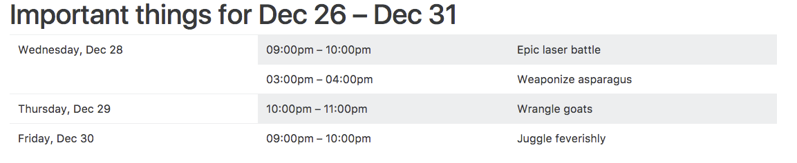

# PrintableCalendar

Generate printable agendas from Google Calendars.

I got sick of Google Calendar's terrible print dialog and decided to code around it. This command line utility will download a week, work week, or month of agenda items and render them in your default browser so you can print them easily.



## Installation and Setup

```
    $ gem install printable_calendar
```

 0. Copy the sample-config.json file.
 1. You need a Google OAuth client ID and secret. You get those [here](https://console.developers.google.com/). First, you have to create a project, then add some OAuth credentials (cselect "OAuth client ID" under the "Create credentials" dropdown). Make sure you add the Calendar API to the project. Put the client ID and secret into the json file (You may also stash them in env vars: `PRINTABLE_CALENDAR_CLIENT_ID` and `PRINTABLE_CALENDAR_CLIENT_SECRET`. Just remove the keys from your JSON file if you do.)
 2. You need a refresh token. Having saved your partially filled out JSON file, run `printable_calendar -g`. That will open a dialog asking you to accept that your app can have access to your data. Just follow the instructions in the terminal. Paste that refresh token into the JSON file. (You can also use an env var for this: `PRINTABLE_CALENDAR_REFRESH_TOKEN`).
 3. Finally you need the calendars you want to pull in info from; grab their IDs through the Google Calendar UI by finding them in the left sidebar, clicking the little down arrow, clicking "settings", and then copying the email-looking thing next to "Calendar ID".
 
## Usage

Run `printable_calendar -c your-config-file.json`. The application will download your events, create an HTML file in your temp dir, and open it in your default browser. All you have to do is print it.

There are a few other options. They're available in both the JSON file and as command line switches. Here are all them:

```
usage: printable_calendar [options]
    -g, --generate   Generate a token
    -h, --help       Print help
    -v, --version    Print version info
    -c, --config     Use a JSON config file
    --client-id      Google client id
    --client-secret  Google client secret
    --refresh-token  Google refresh token
    -p, --period     Time period to use. Accepts work_week, american_week, intl_week, month, day. Defaults to work_week
    --title          Title for this calendar
    --starting-from  Date to anchor on. Defaults to today. Format as YYYY-MM-DD
    --calendar-ids   Google calendar IDs
```

## Contributing

Bug reports and pull requests are welcome on GitHub at https://github.com/icambron/printable_calendar.

## License

The gem is available as open source under the terms of the [MIT License](http://opensource.org/licenses/MIT).
